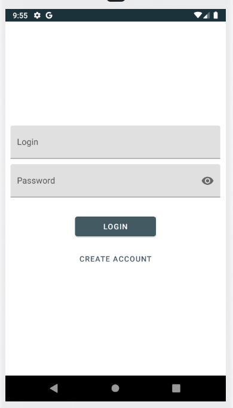
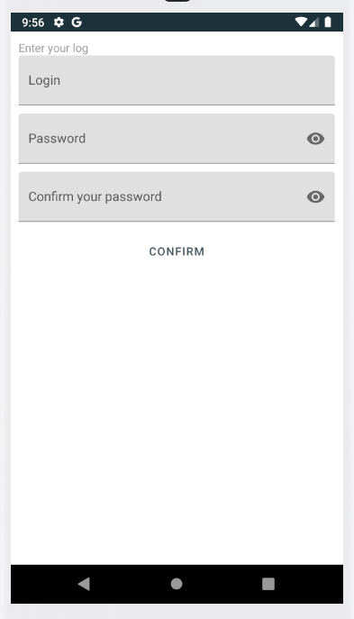
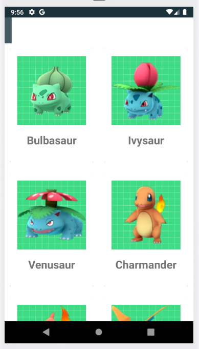

# ProjetAndroid4A
### Auteur : David Touitou
## Présentation
Réalisation dans le cadre d'un projet de 4ème année au sein de l'ESIEA d'une application mobile. Celle-ci permet de se connecter via un login mot de passe pour avoir accès à une liste de pokemons. Elle permet également de créer un compte si nécessaire. La plupart des vérifications au niveau de la création de compte sont faites.

## Consignes respectées
- Une liste d'items utilisant une **recyclerView**
- Utilisation d'une **réelle base de donnée**
- Appel WebService à une **API Rest**
- Affichage de la **liste** en provenance de l'API
- **Architecture MVVM** 
- **Clean Architecture**
- Quelques **tests unitaires**
- Cette application est plus jolie que celle de l'année précédente :)

## Caractéristiques

### Ecran d'accueil.

### Ecran qui affiche la page de création de compte

### Ecran avec la liste de pokémons.

